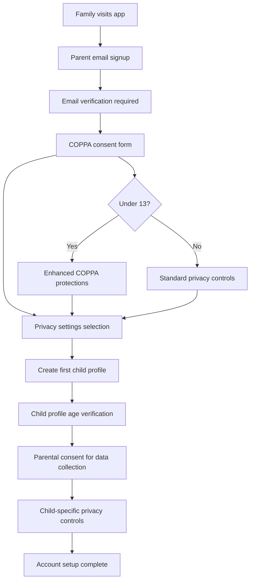
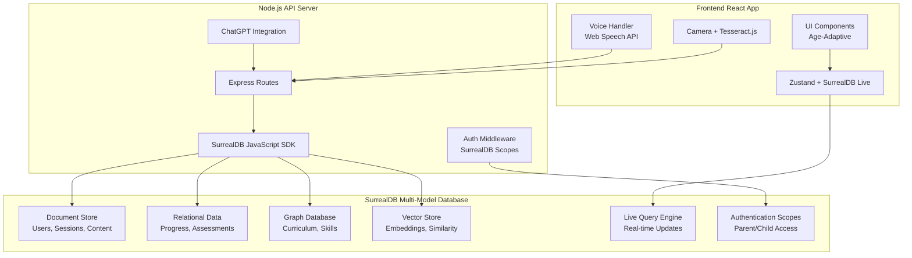

# AI-Powered Homeschooling Application - SurrealDB Architecture Document

## Introduction

This document outlines the complete fullstack architecture for the AI-powered homeschooling application, redesigned to leverage SurrealDB's multi-model database capabilities as the central data layer. This unified approach maximizes SurrealDB's document, relational, and graph database functionality while minimizing infrastructure complexity and cost.

### SurrealDB Integration Strategy

Every architectural component has been evaluated through the question: "Can this be achieved with SurrealDB?" The answer is overwhelmingly yes, allowing us to:

- **Consolidate data storage** - Replace PostgreSQL + Redis + file metadata with SurrealDB
- **Enable real-time features** - Use SurrealDB's live queries for instant progress updates
- **Leverage graph capabilities** - Model learning relationships and curriculum dependencies
- **Utilize vector search** - Store voice and assessment embeddings for similarity matching
- **Simplify deployment** - Single database service instead of multiple data stores

### Change Log
| Date | Version | Description | Author |
|------|---------|-------------|---------|
| 2025-01-15 | 2.0 | SurrealDB-optimized architecture | Winston (Architect) |
| 2025-01-15 | 2.1 | Added comprehensive authentication strategy | Winston (Architect) |

## High Level Architecture

### Technical Summary

The system employs a SurrealDB-centric architecture where the multi-model database serves as the unified data layer for all application needs. SurrealDB's document storage handles user profiles and learning content, its relational capabilities manage structured progress data, graph features model curriculum relationships, and vector search enables intelligent content recommendations. The frontend uses React with TypeScript for age-adaptive interfaces, while the backend leverages Node.js with SurrealDB's native SDKs for real-time data operations.

### Platform and Infrastructure Choice

**Platform:** Self-hosted on free/low-cost providers with open source stack
**Primary Services:** 
- SurrealDB (single-node initially, distributed later)
- Node.js application server
- Static hosting for frontend (Netlify/Vercel free tier)
- ChatGPT API integration
- Tesseract.js for client-side OCR

**Deployment Host and Regions:** 
- Primary: Railway/Render free tier or DigitalOcean $6/month droplet
- Database: SurrealDB embedded or single-node deployment
- CDN: Cloudflare free tier for static assets

### Repository Structure

**Structure:** Monorepo with SurrealDB schema management
**Monorepo Tool:** Turborepo with npm workspaces
**Package Organization:** 
- apps/web - Frontend React application
- apps/api - Backend Node.js server with SurrealDB integration
- packages/database - SurrealDB schema, migrations, and utilities
- packages/shared - Shared types and SurrealDB query builders

### High Level Architecture Diagram

```mermaid
graph TB
    subgraph "Client Layer"
        WEB[Web Application<br/>React + TypeScript]
        CAM[Camera API<br/>WebRTC]
        MIC[Microphone API<br/>Web Speech]
        OCR[Tesseract.js<br/>Client-side OCR]
    end
    
    subgraph "CDN & Edge"
        CF[Cloudflare CDN<br/>Free Tier]
        STATIC[Static Assets<br/>Netlify/Vercel]
    end
    
    subgraph "Application Layer"
        API[API Server<br/>Node.js + Express]
        WS[WebSocket Server<br/>SurrealDB Live Queries]
        AUTH[Authentication<br/>SurrealDB + JWT]
    end
    
    subgraph "AI Services"
        GPT[ChatGPT API<br/>Conversational AI]
        TTS[Web Speech API<br/>Browser Native]
        STT[Web Speech API<br/>Browser Native]
    end
    
    subgraph "SurrealDB Multi-Model Layer"
        SURREAL[(SurrealDB<br/>Single Database)]
        DOC[Document Store<br/>User Profiles, Content]
        REL[Relational Data<br/>Progress, Sessions]
        GRAPH[Graph Database<br/>Curriculum Dependencies]
        VECTOR[Vector Search<br/>Content Similarity]
        LIVE[Live Queries<br/>Real-time Updates]
    end
    
    subgraph "External Services"
        EMAIL[Email Service<br/>Free SMTP or Resend]
        MONITORING[Simple Analytics<br/>Plausible/Umami]
    end
    
    WEB --> CF
    CF --> STATIC
    CAM --> OCR
    MIC --> WS
    
    API --> AUTH
    API --> GPT
    WS --> LIVE
    
    API --> DOC
    API --> REL
    API --> GRAPH
    API --> VECTOR
    
    WS --> SURREAL
    AUTH --> SURREAL
    
    API --> EMAIL
    API --> MONITORING
```



### Architectural Patterns

- **SurrealDB-First Design:** All data operations leverage SurrealDB's multi-model capabilities - _Rationale:_ Simplifies architecture while providing advanced features like real-time queries and graph traversal
- **Event-Driven Architecture:** SurrealDB live queries for real-time updates - _Rationale:_ Eliminates need for separate WebSocket state management
- **Client-Side Processing:** Browser-native speech API and Tesseract.js OCR - _Rationale:_ Reduces server costs and improves privacy
- **Graph-Powered Learning:** Curriculum and skill dependencies modeled as graph relationships - _Rationale:_ Enables intelligent learning path recommendations
- **Vector-Enhanced Intelligence:** Embeddings stored in SurrealDB for content similarity - _Rationale:_ Improves learning recommendations without external vector databases

## Authentication & Authorization Architecture

### Multi-Tier User System

The application implements a family-centric authentication model designed specifically for COPPA compliance and child safety:

**Family Account Structure:**
- **Parent Account:** Primary account holder with billing and family management
- **Child Profiles:** Individual learning profiles within the family account
- **Session Management:** Device-aware, age-appropriate session timeouts
- **Privacy Controls:** Granular settings for data collection and parental visibility

### User Roles and Permissions

```typescript
interface UserRoles {
  PARENT: {
    permissions: [
      "manage_family_account",
      "create_child_profiles", 
      "view_all_child_progress",
      "modify_privacy_settings",
      "access_billing",
      "delete_family_data"
    ];
    restrictions: [
      "cannot_access_child_private_sessions",
      "cannot_modify_child_work_without_permission"
    ];
  };
  CHILD: {
    permissions: [
      "access_learning_content",
      "save_progress",
      "interact_with_ai_tutor",
      "upload_work_photos"
    ];
    restrictions: [
      "age_appropriate_content_only",
      "no_billing_access",
      "no_family_management",
      "parental_oversight_enabled"
    ];
    ageBasedControls: {
      ages6to9: ["simplified_ui", "voice_only_mode", "limited_text_input"];
      ages10to13: ["standard_ui", "voice_and_text", "guided_navigation"];
      ages14to16: ["advanced_ui", "full_features", "independent_learning"];
    };
  };
}
```

### COPPA-Compliant Registration Flow



### SurrealDB Authentication Integration

**Authentication Schema:**

```sql
-- Family accounts with COPPA compliance tracking
DEFINE TABLE auth_families SCHEMAFULL;
DEFINE FIELD id ON auth_families TYPE record<auth_families>;
DEFINE FIELD parent_email ON auth_families TYPE string 
    ASSERT string::is::email($value);
DEFINE FIELD parent_name ON auth_families TYPE string;
DEFINE FIELD created_at ON auth_families TYPE datetime DEFAULT time::now();
DEFINE FIELD subscription_tier ON auth_families TYPE string DEFAULT 'free';
DEFINE FIELD coppa_consent_date ON auth_families TYPE datetime;
DEFINE FIELD coppa_consent_version ON auth_families TYPE string;
DEFINE FIELD privacy_settings ON auth_families TYPE object DEFAULT {
    data_collection: true,
    analytics_sharing: false,
    marketing_emails: false,
    research_participation: false
};
DEFINE FIELD billing_info ON auth_families TYPE object;

-- Child profiles with age-based controls
DEFINE TABLE auth_child_profiles SCHEMAFULL;
DEFINE FIELD id ON auth_child_profiles TYPE record<auth_child_profiles>;
DEFINE FIELD family_id ON auth_child_profiles TYPE record<auth_families>;
DEFINE FIELD child_name ON auth_child_profiles TYPE string;
DEFINE FIELD age_group ON auth_child_profiles TYPE string 
    ASSERT $value IN ['ages6to9', 'ages10to13', 'ages14to16'];
DEFINE FIELD privacy_level ON auth_child_profiles TYPE string DEFAULT 'standard';
DEFINE FIELD learning_preferences ON auth_child_profiles TYPE object;
DEFINE FIELD created_at ON auth_child_profiles TYPE datetime DEFAULT time::now();
DEFINE FIELD last_active ON auth_child_profiles TYPE datetime;
DEFINE FIELD parental_controls ON auth_child_profiles TYPE object DEFAULT {
    voice_recordings_allowed: true,
    camera_uploads_allowed: true,
    ai_interactions_logged: true,
    progress_sharing_enabled: true,
    real_time_monitoring: false
};

-- Session management with family context
DEFINE TABLE auth_sessions SCHEMAFULL;
DEFINE FIELD id ON auth_sessions TYPE record<auth_sessions>;
DEFINE FIELD user_id ON auth_sessions TYPE string;
DEFINE FIELD user_type ON auth_sessions TYPE string ASSERT $value IN ['parent', 'child'];
DEFINE FIELD family_id ON auth_sessions TYPE record<auth_families>;
DEFINE FIELD child_id ON auth_sessions TYPE record<auth_child_profiles> 
    ASSERT $this.user_type = 'child' OR $value = NONE;
DEFINE FIELD expires_at ON auth_sessions TYPE datetime;
DEFINE FIELD device_info ON auth_sessions TYPE object;
DEFINE FIELD last_activity ON auth_sessions TYPE datetime DEFAULT time::now();
DEFINE FIELD session_data ON auth_sessions TYPE object;
```

**Authentication Scopes:**

```sql
-- Parent authentication scope
DEFINE SCOPE parent 
    SESSION 24h
    SIGNIN (
        SELECT * FROM auth_families 
        WHERE parent_email = $email 
        AND crypto::argon2::compare(password, $password)
    )
    SIGNUP (
        CREATE auth_families SET
            parent_email = $email,
            parent_name = $name,
            password = crypto::argon2::generate($password),
            coppa_consent_date = time::now(),
            coppa_consent_version = $coppa_version
    );

-- Child profile selection scope  
DEFINE SCOPE child
    SESSION 4h  -- Shorter sessions for children
    SIGNIN (
        SELECT * FROM auth_child_profiles 
        WHERE family_id = $family_id 
        AND id = $child_profile_id
        AND $parent_session_valid = true
    );
```

### Session Management Strategy

**Multi-Device Family Support:**
- **Shared Devices:** Multiple children can use same tablet with profile switching
- **Session Duration:** Parent sessions (24h), Child sessions (4h with auto-refresh)
- **Cross-Device Sync:** SurrealDB live queries sync progress across devices
- **Parental Override:** Parents can access child sessions for assistance

**Token Strategy:**

```typescript
interface AuthTokens {
  accessToken: {
    duration: "15m";
    payload: {
      userId: string;
      userType: "parent" | "child";
      familyId: string;
      childId?: string;      // For child sessions
      ageGroup?: AgeGroup;   // For age-appropriate content filtering
      permissions: string[];
      privacySettings: ChildPrivacySettings;
    };
  };
  refreshToken: {
    duration: "7d";
    storage: "httpOnly";
    familyScoped: true;     // Can refresh for family members
  };
}
```

### Privacy Controls and Data Protection

**Child Privacy Settings:**

```sql
DEFINE TABLE child_privacy_settings SCHEMAFULL;
DEFINE FIELD child_id ON child_privacy_settings TYPE record<auth_child_profiles>;
DEFINE FIELD data_collection ON child_privacy_settings TYPE object DEFAULT {
    voice_recordings: {
        enabled: true,
        retention_days: 30,
        parent_can_delete: true,
        use_for_improvement: false
    },
    camera_photos: {
        enabled: true,
        retention_days: 90,
        parent_can_view: true,
        auto_delete_after_assessment: false
    },
    progress_tracking: {
        detailed_analytics: true,
        time_tracking: true,
        difficulty_analysis: true,
        parent_real_time_view: false
    },
    ai_interactions: {
        conversation_logging: true,
        parent_can_review: true,
        anonymize_for_research: true
    }
};

DEFINE FIELD parental_visibility ON child_privacy_settings TYPE object DEFAULT {
    real_time_progress: false,
    completed_work_access: true,
    struggling_areas_alerts: true,
    daily_time_reports: true,
    ai_conversation_summaries: true
};
```

### Security Patterns and Route Protection

**API Route Guards:**

```typescript
interface RouteProtection {
  parentOnly: [
    "/api/family/billing",
    "/api/family/child-management", 
    "/api/family/privacy-settings",
    "/api/reports/family-progress"
  ];
  childOnly: [
    "/api/learning/session",
    "/api/learning/submit-work",
    "/api/child/my-progress"
  ];
  ageRestricted: {
    ages6to9: ["/api/learning/voice-only", "/api/learning/simple-games"];
    ages10to13: ["/api/learning/standard", "/api/learning/guided-projects"];
    ages14to16: ["/api/learning/advanced", "/api/learning/independent-study"];
  };
  familyScoped: [
    "/api/family/*"  // All family data requires family_id validation
  ];
}
```

**Data Access Control:**

```sql
-- Row-level security for child data
DEFINE TABLE learning_sessions PERMISSIONS
    FOR select WHERE 
        (child_id.family_id = $auth.family_id) OR
        ($auth.user_type = 'child' AND child_id = $auth.child_id)
    FOR create WHERE 
        child_id.family_id = $auth.family_id
    FOR update WHERE 
        child_id.family_id = $auth.family_id;

-- Field-level permissions for sensitive data
DEFINE FIELD voice_recording_data ON learning_sessions 
    PERMISSIONS FOR select WHERE 
        ($auth.user_type = 'parent' AND child_id.family_id = $auth.family_id) OR
        ($auth.user_type = 'child' AND child_id = $auth.child_id AND 
         child_id.parental_controls.voice_recordings_allowed = true);
```

### Authentication Middleware Implementation

**Express.js Auth Middleware:**

```typescript
// Authentication verification
export const authenticateToken = async (req: Request, res: Response, next: NextFunction) => {
  try {
    const token = req.headers.authorization?.split(' ')[1];
    if (!token) return res.status(401).json({ error: 'Access token required' });

    // Verify with SurrealDB
    const decoded = jwt.verify(token, process.env.JWT_SECRET);
    const session = await db.query(`
      SELECT * FROM auth_sessions 
      WHERE user_id = $user_id AND expires_at > time::now()
    `, { user_id: decoded.userId });

    if (!session[0]) return res.status(401).json({ error: 'Invalid session' });

    req.user = decoded;
    req.session = session[0];
    next();
  } catch (error) {
    return res.status(403).json({ error: 'Invalid token' });
  }
};

// Age-based content filtering
export const ageAppropriateContent = (req: Request, res: Response, next: NextFunction) => {
  if (req.user.userType === 'child') {
    req.ageGroup = req.user.ageGroup;
    req.contentFilter = getAgeAppropriateFilter(req.user.ageGroup);
  }
  next();
};

// Family data access validation
export const validateFamilyAccess = async (req: Request, res: Response, next: NextFunction) => {
  const familyId = req.params.familyId || req.body.familyId;
  if (req.user.familyId !== familyId) {
    return res.status(403).json({ error: 'Access denied to family data' });
  }
  next();
};
```

## Tech Stack

This is the DEFINITIVE technology selection optimized for SurrealDB integration and cost efficiency.

### Technology Stack Table

| Category | Technology | Version | Purpose | Rationale |
|----------|------------|---------|---------|-----------|
| **Multi-Model Database** | SurrealDB | 2.0+ | Primary data store | Replaces PostgreSQL + Redis + file metadata with single solution |
| **Frontend Language** | TypeScript | 5.3.3 | Type-safe frontend development | Essential for complex educational logic and SurrealDB type safety |
| **Frontend Framework** | React | 18.2.0 | User interface framework | Mature ecosystem with excellent real-time capabilities |
| **UI Component Library** | Radix UI | 1.0.4 | Accessible UI primitives | WCAG compliance critical for educational software |
| **State Management** | Zustand + SurrealDB Live | 4.4.7 | Reactive state management | SurrealDB live queries provide real-time updates |
| **Backend Language** | Node.js | 20.11.0 LTS | Server runtime environment | Excellent SurrealDB SDK and real-time capabilities |
| **Backend Framework** | Express.js | 4.18.2 | Web application framework | Lightweight, integrates well with SurrealDB |
| **Database SDK** | surrealdb.js | 1.0+ | SurrealDB JavaScript SDK | Official SDK with full feature support |
| **API Style** | REST + SurrealDB RPC | OpenAPI 3.0 | API architecture | REST for CRUD, SurrealDB RPC for complex queries |
| **Authentication** | SurrealDB Auth + JWT | Latest | User authentication | SurrealDB's built-in auth with scope-based access |
| **File Storage** | SurrealDB + Base64 | Latest | Small file storage | Store images as Base64 in SurrealDB for simplicity |
| **Cache** | SurrealDB Memory | Latest | Session and temporary data | SurrealDB's in-memory capabilities replace Redis |
| **Real-time** | SurrealDB Live Queries | Latest | Live data updates | Native real-time without WebSocket complexity |
| **Vector Search** | SurrealDB Vectors | Latest | Content similarity | Built-in vector storage and similarity functions |
| **Frontend Testing** | Vitest + React Testing Library | 1.1.0 + 13.4.0 | Frontend testing | Fast, modern testing stack |
| **Backend Testing** | Jest + Supertest | 29.7.0 + 6.3.3 | Backend testing | Comprehensive API testing |
| **E2E Testing** | Playwright | 1.40.1 | End-to-end testing | Complete user journey testing |
| **Build Tool** | Turborepo | 1.11.2 | Monorepo orchestration | Efficient builds for SurrealDB schema management |
| **Bundler** | Vite | 5.0.10 | Frontend bundling | Fast development with SurrealDB SDK integration |
| **Deployment** | Railway/Render | Latest | Free tier hosting | Simple deployment for Node.js + SurrealDB |
| **Monitoring** | Plausible Analytics | Latest | Privacy-focused analytics | Open source, GDPR compliant |
| **Logging** | Winston + Console | 3.11.0 | Structured logging | Simple logging for development phase |
| **CSS Framework** | Tailwind CSS | 3.3.6 | Utility-first styling | Age-adaptive design system |
| **OCR** | Tesseract.js | 5.0+ | Client-side text recognition | Privacy-preserving work assessment |

## SurrealDB Data Models

SurrealDB's multi-model approach allows us to store different types of data optimally while maintaining relationships.

### User Management (Document + Relations)

```sql
-- Family and user profiles with embedded privacy settings
DEFINE TABLE families SCHEMAFULL;
DEFINE FIELD id ON families TYPE record<families>;
DEFINE FIELD parent_name ON families TYPE string;
DEFINE FIELD parent_email ON families TYPE string ASSERT string::is::email($value);
DEFINE FIELD subscription_tier ON families TYPE string DEFAULT 'free';
DEFINE FIELD privacy_preferences ON families TYPE object;
DEFINE FIELD billing_info ON families TYPE object;
DEFINE FIELD created_at ON families TYPE datetime DEFAULT time::now();

-- Child profiles with age-based configurations
DEFINE TABLE child_profiles SCHEMAFULL;
DEFINE FIELD id ON child_profiles TYPE record<child_profiles>;
DEFINE FIELD family_id ON child_profiles TYPE record<families>;
DEFINE FIELD name ON child_profiles TYPE string;
DEFINE FIELD age_group ON child_profiles TYPE string ASSERT $value IN ['ages6to9', 'ages10to13', 'ages14to16'];
DEFINE FIELD learning_style ON child_profiles TYPE string;
DEFINE FIELD interests ON child_profiles TYPE array<string>;
DEFINE FIELD accessibility_needs ON child_profiles TYPE array<string>;
DEFINE FIELD created_at ON child_profiles TYPE datetime DEFAULT time::now();
```

### Learning Progress (Relations + Time Series)

```sql
-- Learning sessions with real-time capabilities
DEFINE TABLE learning_sessions SCHEMAFULL;
DEFINE FIELD id ON learning_sessions TYPE record<learning_sessions>;
DEFINE FIELD child_id ON learning_sessions TYPE record<child_profiles>;
DEFINE FIELD subject ON learning_sessions TYPE string;
DEFINE FIELD topic ON learning_sessions TYPE string;
DEFINE FIELD start_time ON learning_sessions TYPE datetime DEFAULT time::now();
DEFINE FIELD end_time ON learning_sessions TYPE datetime;
DEFINE FIELD duration_minutes ON learning_sessions TYPE int;
DEFINE FIELD attention_metrics ON learning_sessions TYPE object; -- Focus, engagement scores
DEFINE FIELD voice_interactions ON learning_sessions TYPE array<object>; -- Voice conversation data
DEFINE FIELD completed_activities ON learning_sessions TYPE array<string>;
DEFINE FIELD struggle_points ON learning_sessions TYPE array<object>; -- Where child needed help

-- Progress tracking for individual skills
DEFINE TABLE skill_mastery SCHEMAFULL;
DEFINE FIELD id ON skill_mastery TYPE record<skill_mastery>;
DEFINE FIELD child_id ON skill_mastery TYPE record<child_profiles>;
DEFINE FIELD skill_id ON skill_mastery TYPE string;
DEFINE FIELD skill_name ON skill_mastery TYPE string;
DEFINE FIELD mastery_level ON skill_mastery TYPE string DEFAULT 'not_started';
DEFINE FIELD first_attempt ON skill_mastery TYPE datetime;
DEFINE FIELD last_practiced ON skill_mastery TYPE datetime;
DEFINE FIELD practice_count ON skill_mastery TYPE int DEFAULT 0;
DEFINE FIELD success_rate ON skill_mastery TYPE float DEFAULT 0.0;
DEFINE FIELD skill_embedding ON skill_mastery TYPE array<float>; -- Vector for recommendations

-- Graph relationships for skill dependencies
DEFINE TABLE requires SCHEMAFULL;
DEFINE FIELD in ON requires TYPE record<skill_mastery>;
DEFINE FIELD out ON requires TYPE record<skill_mastery>;
DEFINE FIELD dependency_strength ON requires TYPE float DEFAULT 1.0;

-- Index for vector similarity searches
DEFINE INDEX skill_vector_idx ON skill_mastery FIELDS skill_embedding MTREE DIMENSION 384;
```

### Curriculum and Content (Graph + Vector)

```sql
-- Curriculum topics with content embeddings
DEFINE TABLE curriculum_topics SCHEMAFULL;
DEFINE FIELD id ON curriculum_topics TYPE record<curriculum_topics>;
DEFINE FIELD subject ON curriculum_topics TYPE string;
DEFINE FIELD topic_name ON curriculum_topics TYPE string;
DEFINE FIELD difficulty_level ON curriculum_topics TYPE int ASSERT $value >= 1 AND $value <= 10;
DEFINE FIELD content_text ON curriculum_topics TYPE string;
DEFINE FIELD content_embedding ON curriculum_topics TYPE array<float>; -- Vector for similarity
DEFINE FIELD age_appropriateness ON curriculum_topics TYPE array<int>; -- [5,6,7,8,9,10,11,12,13]
DEFINE FIELD learning_objectives ON curriculum_topics TYPE array<string>;

-- Graph relationships for curriculum progression
DEFINE TABLE prerequisite SCHEMAFULL;
DEFINE FIELD in ON prerequisite TYPE record<curriculum_topics>;
DEFINE FIELD out ON prerequisite TYPE record<curriculum_topics>;
DEFINE FIELD prerequisite_strength ON prerequisite TYPE float DEFAULT 1.0;

-- Vector index for content similarity
DEFINE INDEX content_vector_idx ON curriculum_topics FIELDS content_embedding MTREE DIMENSION 384;
```

## SurrealDB-Powered Components

### Authentication Service

**Responsibility:** Family account management, child profile creation, COPPA compliance

**SurrealDB Features Used:**
- Authentication scopes for parent/child access levels
- Document storage for family and profile data
- Real-time session management

**Key Authentication Queries:**

```sql
-- Create family account with COPPA compliance
CREATE families SET
    parent_name = $name,
    parent_email = $email,
    password = crypto::argon2::generate($password),
    coppa_consent_date = time::now(),
    privacy_preferences = $privacy_settings;

-- Child profile with family relationship
CREATE child_profiles SET
    family_id = $family_id,
    name = $child_name,
    age_group = $age_group,
    parental_controls = $privacy_controls;

-- Session with family context
CREATE auth_sessions SET
    user_id = $user_id,
    user_type = $user_type,
    family_id = $family_id,
    child_id = $child_id,
    expires_at = time::now() + $session_duration;
```

### Real-Time Progress Service

**Responsibility:** Live progress tracking, parental dashboards, achievement notifications

**SurrealDB Features Used:**
- Live queries for real-time progress updates
- Time-series data for learning analytics
- Graph relationships for skill dependencies

```sql
-- Live query for real-time progress dashboard
LIVE SELECT 
    child_id,
    subject,
    COUNT(*) as session_count,
    AVG(attention_metrics.focus_score) as avg_focus,
    time::group(start_time, '1d') as date
FROM learning_sessions 
WHERE child_id.family_id = $family_id 
    AND start_time > time::now() - 7d
GROUP BY child_id, subject, date;

-- Real-time skill mastery updates
LIVE SELECT 
    skill_name,
    mastery_level,
    success_rate,
    last_practiced
FROM skill_mastery 
WHERE child_id = $child_id
    AND last_practiced > time::now() - 1h;
```

### Intelligent Learning Service

**Responsibility:** AI-powered learning recommendations, curriculum adaptation

**SurrealDB Features Used:**
- Graph traversal for prerequisite checking
- Vector similarity for content recommendations
- ML integration with SurrealDB

```sql
-- Find next recommended topics based on mastered skills
SELECT topic.*, path.dependency_strength
FROM curriculum_topics as topic
LET path = (
    SELECT * FROM $parent<-prerequisite<-skill_mastery 
    WHERE child_id = $child_id AND mastery_level = 'proficient'
) as next_topics
FROM skill_mastery 
WHERE child_id = $child_id AND mastery_level = 'proficient'
FETCH next_topics;

-- Vector similarity search for related content
SELECT *, vector::similarity::cosine(content_embedding, $query_embedding) as similarity
FROM curriculum_topics 
WHERE vector::similarity::cosine(content_embedding, $query_embedding) > 0.8
ORDER BY similarity DESC
LIMIT 5;
```

### Assessment Service (Vector + ML Integration)

**Responsibility:** Camera-based work analysis with SurrealDB vector storage for pattern recognition

**SurrealDB Features Used:**
- Vector embeddings for work pattern recognition
- ML model integration for assessment analysis
- Document storage for assessment metadata

```sql
-- Store assessment with embedding for similarity matching
CREATE assessment_results SET
    child_id = $child_id,
    session_id = $session_id,
    work_image_base64 = $image_data,
    ocr_text = $extracted_text,
    assessment_embedding = $work_embedding,
    accuracy_score = $score,
    feedback_text = $feedback;

-- Find similar past work for pattern analysis
SELECT *, vector::similarity::cosine(assessment_embedding, $current_embedding) as similarity
FROM assessment_results
WHERE child_id = $child_id AND similarity > 0.7
ORDER BY similarity DESC;
```

## Component Diagrams



## SurrealDB Schema Evolution Strategy

### Migration Management

```sql
-- Version tracking table
DEFINE TABLE schema_versions SCHEMAFULL;
DEFINE FIELD version ON schema_versions TYPE string;
DEFINE FIELD applied_at ON schema_versions TYPE datetime DEFAULT time::now();
DEFINE FIELD description ON schema_versions TYPE string;

-- Migration scripts as SurrealQL files
-- migrations/001_initial_schema.surql
-- migrations/002_add_vector_search.surql
-- migrations/003_curriculum_graph.surql
```

### Performance Optimization

```sql
-- Indexes for common queries
DEFINE INDEX child_sessions_idx ON learning_sessions FIELDS child_id, start_time;
DEFINE INDEX skill_mastery_idx ON skill_mastery FIELDS child_id, skill_id;
DEFINE INDEX progress_tracking_idx ON progress_profiles FIELDS child_id, subject, updated_at;

-- Vector indexes for similarity searches
DEFINE INDEX content_similarity_idx ON curriculum_topics FIELDS content_embedding MTREE DIMENSION 384;
DEFINE INDEX skill_similarity_idx ON skill_mastery FIELDS skill_embedding MTREE DIMENSION 384;

-- Authentication and session indexes
DEFINE INDEX family_email_idx ON auth_families FIELDS parent_email;
DEFINE INDEX session_user_idx ON auth_sessions FIELDS user_id, expires_at;
DEFINE INDEX child_family_idx ON auth_child_profiles FIELDS family_id, age_group;
```

## Frontend Architecture

### React Component Structure

```typescript
// Age-adaptive component system
interface AgeAdaptiveProps {
  ageGroup: 'ages6to9' | 'ages10to13' | 'ages14to16';
  content: ComponentContent;
}

// Main application structure
src/
├── components/
│   ├── auth/
│   │   ├── FamilyRegistration.tsx
│   │   ├── ChildProfileSelector.tsx
│   │   └── COPPAConsent.tsx
│   ├── learning/
│   │   ├── LearningSession.tsx
│   │   ├── VoiceInteraction.tsx
│   │   └── WorkAssessment.tsx
│   ├── dashboard/
│   │   ├── ParentDashboard.tsx
│   │   ├── ChildProgress.tsx
│   │   └── FamilyOverview.tsx
│   └── age-adaptive/
│       ├── UIAges6to9.tsx
│       ├── UIAges10to13.tsx
│       └── UIAges14to16.tsx
├── hooks/
│   ├── useSurrealAuth.ts
│   ├── useLiveProgress.ts
│   └── useAgeAdaptive.ts
├── services/
│   ├── surrealdb.ts
│   ├── auth.ts
│   └── ai-tutor.ts
└── stores/
    ├── authStore.ts
    ├── learningStore.ts
    └── progressStore.ts
```

### State Management with SurrealDB Live Queries

```typescript
// Real-time progress store with SurrealDB integration
import { create } from 'zustand';
import { surrealdb } from '../services/surrealdb';

interface ProgressStore {
  currentSession: LearningSession | null;
  liveProgress: ProgressUpdate[];
  startLiveTracking: (childId: string) => void;
  stopLiveTracking: () => void;
}

export const useProgressStore = create<ProgressStore>((set, get) => ({
  currentSession: null,
  liveProgress: [],
  
  startLiveTracking: async (childId: string) => {
    // SurrealDB live query for real-time progress
    const unsubscribe = await surrealdb.live(`
      SELECT 
        skill_name,
        mastery_level,
        success_rate,
        last_practiced
      FROM skill_mastery 
      WHERE child_id = $child_id
    `, { child_id: childId }, (data) => {
      set({ liveProgress: data });
    });
    
    // Store unsubscribe function for cleanup
    set({ unsubscribeLive: unsubscribe });
  },
  
  stopLiveTracking: () => {
    const { unsubscribeLive } = get();
    if (unsubscribeLive) {
      unsubscribeLive();
    }
  }
}));
```

### Authentication Hook with Family Context

```typescript
// Custom hook for family-scoped authentication
export const useSurrealAuth = () => {
  const [user, setUser] = useState<AuthUser | null>(null);
  const [family, setFamily] = useState<Family | null>(null);
  const [childProfiles, setChildProfiles] = useState<ChildProfile[]>([]);

  const loginParent = async (email: string, password: string) => {
    try {
      const token = await surrealdb.signin({
        namespace: 'homeschool',
        database: 'main',
        scope: 'parent',
        email,
        password
      });
      
      // Fetch family data and child profiles
      const familyData = await surrealdb.query(`
        SELECT *, 
          (SELECT * FROM auth_child_profiles WHERE family_id = $auth.id) as children
        FROM auth_families WHERE id = $auth.id
      `);
      
      setUser({ type: 'parent', ...familyData[0] });
      setFamily(familyData[0]);
      setChildProfiles(familyData[0].children);
      
    } catch (error) {
      throw new Error('Login failed');
    }
  };

  const selectChildProfile = async (childId: string) => {
    try {
      const childToken = await surrealdb.signin({
        namespace: 'homeschool',
        database: 'main',
        scope: 'child',
        family_id: family?.id,
        child_profile_id: childId,
        parent_session_valid: true
      });
      
      const childData = childProfiles.find(c => c.id === childId);
      setUser({ type: 'child', ...childData });
      
    } catch (error) {
      throw new Error('Child profile selection failed');
    }
  };

  return {
    user,
    family,
    childProfiles,
    loginParent,
    selectChildProfile,
    logout: () => surrealdb.invalidate()
  };
};
```

## Backend Architecture

### Express.js API Structure

```typescript
// Main application structure
apps/api/
├── src/
│   ├── routes/
│   │   ├── auth.ts           // Family registration, login
│   │   ├── children.ts       // Child profile management
│   │   ├── learning.ts       // Learning sessions, progress
│   │   ├── assessment.ts     // Work evaluation, feedback
│   │   └── family.ts         // Family dashboard, settings
│   ├── middleware/
│   │   ├── auth.ts           // JWT + SurrealDB auth
│   │   ├── coppa.ts          // COPPA compliance checks
│   │   ├── ageGate.ts        // Age-appropriate content
│   │   └── familyAccess.ts   // Family data validation
│   ├── services/
│   │   ├── surrealdb.ts      // Database connection
│   │   ├── chatgpt.ts        // AI tutor integration
│   │   ├── assessment.ts     // Work evaluation logic
│   │   └── notifications.ts  // Real-time updates
│   └── types/
│       ├── auth.ts
│       ├── learning.ts
│       └── family.ts
```

### COPPA Compliance Middleware

```typescript
// COPPA compliance validation
export const coppaCompliance = async (req: Request, res: Response, next: NextFunction) => {
  try {
    if (req.user?.userType === 'child') {
      const childProfile = await surrealdb.query(`
        SELECT 
          age_group,
          family_id.coppa_consent_date,
          family_id.privacy_settings,
          parental_controls
        FROM auth_child_profiles 
        WHERE id = $child_id
      `, { child_id: req.user.childId });

      if (!childProfile[0]) {
        return res.status(403).json({ error: 'Child profile not found' });
      }

      const { coppa_consent_date, privacy_settings, parental_controls } = childProfile[0];
      
      // Ensure COPPA consent is current (within 1 year)
      const consentAge = Date.now() - new Date(coppa_consent_date).getTime();
      const oneYear = 365 * 24 * 60 * 60 * 1000;
      
      if (consentAge > oneYear) {
        return res.status(403).json({ 
          error: 'COPPA consent expired',
          action: 'parent_reconfirmation_required'
        });
      }

      // Add compliance context to request
      req.coppaContext = {
        consentValid: true,
        privacySettings: privacy_settings,
        parentalControls: parental_controls,
        dataCollectionAllowed: privacy_settings.data_collection
      };
    }
    
    next();
  } catch (error) {
    return res.status(500).json({ error: 'COPPA compliance check failed' });
  }
};
```

### Learning Session API with Real-time Updates

```typescript
// Learning session management
router.post('/api/learning/session/start', 
  authenticateToken,
  ageAppropriateContent,
  coppaCompliance,
  async (req: Request, res: Response) => {
    try {
      const { childId, subject, topic } = req.body;
      
      // Validate family access
      if (req.user.familyId !== req.body.familyId) {
        return res.status(403).json({ error: 'Family access denied' });
      }

      // Create learning session
      const session = await surrealdb.query(`
        CREATE learning_sessions SET
          child_id = $child_id,
          subject = $subject,
          topic = $topic,
          start_time = time::now(),
          attention_metrics = {},
          voice_interactions = [],
          privacy_compliant = $coppa_compliant
      `, {
        child_id: childId,
        subject,
        topic,
        coppa_compliant: req.coppaContext?.dataCollectionAllowed || false
      });

      // Start live progress tracking for parents (if enabled)
      if (req.coppaContext?.parentalControls?.real_time_monitoring) {
        await surrealdb.query(`
          CREATE live_session_updates SET
            session_id = $session_id,
            family_id = $family_id,
            update_type = 'session_started',
            timestamp = time::now()
        `, {
          session_id: session[0].id,
          family_id: req.user.familyId
        });
      }

      res.json({ 
        success: true, 
        sessionId: session[0].id,
        privacyMode: req.coppaContext?.dataCollectionAllowed ? 'full' : 'minimal'
      });
      
    } catch (error) {
      res.status(500).json({ error: 'Failed to start learning session' });
    }
  }
);
```

## Deployment Architecture

### Free/Low-Cost Hosting Strategy

**SurrealDB Deployment Options:**

1. **Development:** SurrealDB embedded mode with file storage
2. **Production (Free Tier):** Railway/Render with SurrealDB single-node
3. **Production (Paid):** DigitalOcean droplet ($6/month) with SurrealDB

**Frontend Hosting:**
- Netlify or Vercel free tier for static React build
- Cloudflare Pages as backup option

**Cost Breakdown:**
- Database: $0 (embedded) or $6/month (DigitalOcean)
- Frontend: $0 (Netlify/Vercel free tier)  
- CDN: $0 (Cloudflare free tier)
- ChatGPT API: Pay-per-use
- **Total: $0-6/month + API usage**

### Docker Configuration

```dockerfile
# Multi-stage build for SurrealDB + Node.js
FROM node:20-alpine as builder
WORKDIR /app
COPY package*.json ./
RUN npm ci --only=production

FROM surrealdb/surrealdb:latest as surrealdb

FROM node:20-alpine
RUN apk add --no-cache curl
COPY --from=surrealdb /surreal /usr/local/bin/surreal
COPY --from=builder /app/node_modules ./node_modules
COPY . .

EXPOSE 3000 8000
CMD ["sh", "-c", "surreal start --bind 0.0.0.0:8000 file://data.db & npm start"]
```

## Security Implementation

### SurrealDB Security Features

```sql
-- Enhanced authentication tokens with family context
DEFINE TOKEN parent_jwt ON SCOPE parent TYPE HS512 VALUE "your-secret-key";
DEFINE TOKEN child_jwt ON SCOPE child TYPE HS512 VALUE "your-secret-key";

-- Field-level permissions with COPPA compliance
DEFINE FIELD voice_recording_data ON learning_sessions 
    PERMISSIONS FOR select WHERE 
      ($scope = 'parent' AND child_id.family_id = $auth.family_id) OR
      ($scope = 'child' AND child_id = $auth.child_id AND 
       child_id.parental_controls.voice_recordings_allowed = true);

-- Family-scoped data access
DEFINE TABLE learning_sessions PERMISSIONS 
    FOR select WHERE child_id.family_id = $auth.family_id
    FOR create WHERE child_id.family_id = $auth.family_id AND
      $auth.coppa_consent_valid = true;

-- Child data protection
DEFINE FIELD personal_info ON auth_child_profiles
    PERMISSIONS FOR select WHERE 
      $auth.user_type = 'parent' AND family_id = $auth.family_id;
```

### Data Protection and Privacy

- **Encryption at Rest:** SurrealDB built-in encryption
- **API Security:** JWT tokens with SurrealDB scopes and family validation
- **Input Validation:** SurrealDB schema constraints with COPPA compliance
- **Privacy Controls:** Client-side OCR with Tesseract.js for sensitive work
- **COPPA Compliance:** Automated consent tracking and data retention policies

## Advanced SurrealDB Features Usage

### Real-Time Family Analytics

```sql
-- Live query for parent dashboard with privacy controls
LIVE SELECT 
    child_id,
    child_id.name as child_name,
    subject,
    COUNT(*) as session_count,
    AVG(attention_metrics.focus_score) as avg_focus,
    time::group(start_time, '1d') as date
FROM learning_sessions 
WHERE child_id.family_id = $family_id 
    AND start_time > time::now() - 7d
    AND child_id.parental_controls.progress_sharing_enabled = true
GROUP BY child_id, subject, date;
```

### Intelligent Content Recommendations with Privacy

```sql
-- Graph traversal + vector similarity for personalized learning
-- Respects age appropriateness and parental controls
SELECT 
    topic.*,
    vector::similarity::cosine(topic.content_embedding, $child_interests) as relevance,
    path.prerequisite_strength
FROM curriculum_topics as topic
LET path = (
    SELECT * FROM $parent<-prerequisite<-skill_mastery 
    WHERE child_id = $child_id 
      AND mastery_level = 'proficient'
      AND child_id.parental_controls.ai_interactions_logged = true
)
WHERE topic.age_appropriateness CONTAINS $child_age
    AND relevance > 0.7
    AND topic.coppa_compliant = true
ORDER BY relevance DESC, path.prerequisite_strength ASC
LIMIT 10;
```

### COPPA-Compliant Learning Pattern Analysis

```sql
-- Analytics with automatic data anonymization for under-13 users
SELECT 
    child.id,
    CASE 
        WHEN child.age_group = 'ages6to9' THEN 'anonymous_6_9'
        WHEN child.age_group = 'ages10to13' THEN 'anonymous_10_13'
        ELSE child.name 
    END as display_name,
    subject,
    {
        mastery_trend: math::percentile::90(skill_progress.success_rate),
        attention_pattern: time::group(sessions.attention_metrics.focus_score, '1h'),
        difficulty_progression: sessions.topic->curriculum_topics.difficulty_level
    } as analytics
FROM auth_child_profiles as child
RELATE child->has_progress->progress_profiles as progress
RELATE child->participates_in->learning_sessions as sessions
RELATE child->masters->skill_mastery as skill_progress
WHERE child.family_id = $family_id
    AND child.parental_controls.analytics_sharing = true
    AND sessions.privacy_compliant = true
GROUP BY child.id, subject;
```

## Next Steps

### Architecture Validation

1. **Run Architecture Checklist:** Validate SurrealDB integration and authentication decisions
2. **COPPA Compliance Review:** Legal review of child data handling procedures
3. **Security Audit:** Penetration testing of authentication and data access controls
4. **Performance Testing:** Vector search and live query performance under load
5. **Schema Validation:** Test multi-model relationships and complex queries

### Implementation Priorities

1. **Authentication Foundation:** Family registration, child profiles, session management
2. **COPPA Compliance:** Consent tracking, data retention, privacy controls
3. **Basic Learning Engine:** Simple AI tutoring with voice interaction
4. **Progress Tracking:** Real-time updates for parents and children
5. **Assessment System:** Camera-based work evaluation with privacy protection

### Compliance and Legal Considerations

1. **COPPA Certification:** Engage with legal team for compliance certification
2. **Privacy Policy:** Draft comprehensive privacy policy covering child data
3. **Terms of Service:** Family-friendly terms with parental consent requirements
4. **Data Retention:** Implement automated data deletion for COPPA compliance
5. **International Compliance:** Review GDPR requirements for global families

The architecture now provides a comprehensive, COPPA-compliant foundation for building an AI-powered homeschooling application that prioritizes child safety, family privacy, and educational effectiveness while leveraging SurrealDB's advanced multi-model capabilities.