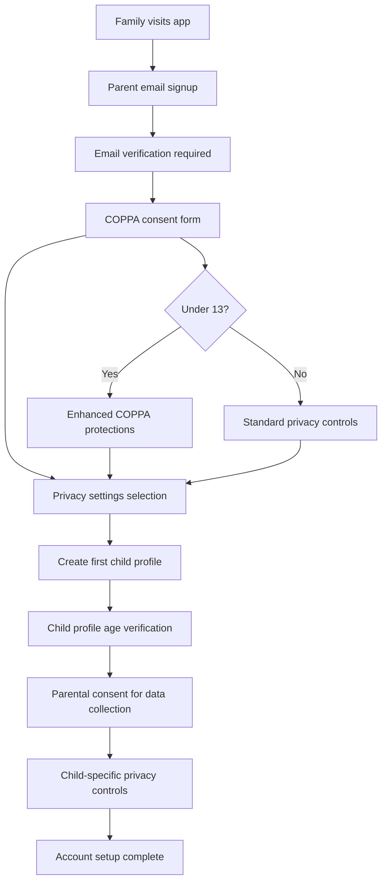

# Authentication & Authorization Architecture

## Multi-Tier User System

The application implements a family-centric authentication model designed specifically for COPPA compliance and child safety:

**Family Account Structure:**
- **Parent Account:** Primary account holder with billing and family management
- **Child Profiles:** Individual learning profiles within the family account
- **Session Management:** Device-aware, age-appropriate session timeouts
- **Privacy Controls:** Granular settings for data collection and parental visibility

## User Roles and Permissions

```typescript
interface UserRoles {
  PARENT: {
    permissions: [
      "manage_family_account",
      "create_child_profiles", 
      "view_all_child_progress",
      "modify_privacy_settings",
      "access_billing",
      "delete_family_data"
    ];
    restrictions: [
      "cannot_access_child_private_sessions",
      "cannot_modify_child_work_without_permission"
    ];
  };
  CHILD: {
    permissions: [
      "access_learning_content",
      "save_progress",
      "interact_with_ai_tutor",
      "upload_work_photos"
    ];
    restrictions: [
      "age_appropriate_content_only",
      "no_billing_access",
      "no_family_management",
      "parental_oversight_enabled"
    ];
    ageBasedControls: {
      ages6to9: ["simplified_ui", "voice_only_mode", "limited_text_input"];
      ages10to13: ["standard_ui", "voice_and_text", "guided_navigation"];
      ages14to16: ["advanced_ui", "full_features", "independent_learning"];
    };
  };
}
```

## COPPA-Compliant Registration Flow



## SurrealDB Authentication Integration

**Authentication Schema:**

```sql
-- Family accounts with COPPA compliance tracking
DEFINE TABLE auth_families SCHEMAFULL;
DEFINE FIELD id ON auth_families TYPE record<auth_families>;
DEFINE FIELD parent_email ON auth_families TYPE string 
    ASSERT string::is::email($value);
DEFINE FIELD parent_name ON auth_families TYPE string;
DEFINE FIELD created_at ON auth_families TYPE datetime DEFAULT time::now();
DEFINE FIELD subscription_tier ON auth_families TYPE string DEFAULT 'free';
DEFINE FIELD coppa_consent_date ON auth_families TYPE datetime;
DEFINE FIELD coppa_consent_version ON auth_families TYPE string;
DEFINE FIELD privacy_settings ON auth_families TYPE object DEFAULT {
    data_collection: true,
    analytics_sharing: false,
    marketing_emails: false,
    research_participation: false
};
DEFINE FIELD billing_info ON auth_families TYPE object;

-- Child profiles with age-based controls
DEFINE TABLE auth_child_profiles SCHEMAFULL;
DEFINE FIELD id ON auth_child_profiles TYPE record<auth_child_profiles>;
DEFINE FIELD family_id ON auth_child_profiles TYPE record<auth_families>;
DEFINE FIELD child_name ON auth_child_profiles TYPE string;
DEFINE FIELD age_group ON auth_child_profiles TYPE string 
    ASSERT $value IN ['ages6to9', 'ages10to13', 'ages14to16'];
DEFINE FIELD privacy_level ON auth_child_profiles TYPE string DEFAULT 'standard';
DEFINE FIELD learning_preferences ON auth_child_profiles TYPE object;
DEFINE FIELD created_at ON auth_child_profiles TYPE datetime DEFAULT time::now();
DEFINE FIELD last_active ON auth_child_profiles TYPE datetime;
DEFINE FIELD parental_controls ON auth_child_profiles TYPE object DEFAULT {
    voice_recordings_allowed: true,
    camera_uploads_allowed: true,
    ai_interactions_logged: true,
    progress_sharing_enabled: true,
    real_time_monitoring: false
};

-- Session management with family context
DEFINE TABLE auth_sessions SCHEMAFULL;
DEFINE FIELD id ON auth_sessions TYPE record<auth_sessions>;
DEFINE FIELD user_id ON auth_sessions TYPE string;
DEFINE FIELD user_type ON auth_sessions TYPE string ASSERT $value IN ['parent', 'child'];
DEFINE FIELD family_id ON auth_sessions TYPE record<auth_families>;
DEFINE FIELD child_id ON auth_sessions TYPE record<auth_child_profiles> 
    ASSERT $this.user_type = 'child' OR $value = NONE;
DEFINE FIELD expires_at ON auth_sessions TYPE datetime;
DEFINE FIELD device_info ON auth_sessions TYPE object;
DEFINE FIELD last_activity ON auth_sessions TYPE datetime DEFAULT time::now();
DEFINE FIELD session_data ON auth_sessions TYPE object;
```

**Authentication Scopes:**

```sql
-- Parent authentication scope
DEFINE SCOPE parent 
    SESSION 24h
    SIGNIN (
        SELECT * FROM auth_families 
        WHERE parent_email = $email 
        AND crypto::argon2::compare(password, $password)
    )
    SIGNUP (
        CREATE auth_families SET
            parent_email = $email,
            parent_name = $name,
            password = crypto::argon2::generate($password),
            coppa_consent_date = time::now(),
            coppa_consent_version = $coppa_version
    );

-- Child profile selection scope  
DEFINE SCOPE child
    SESSION 4h  -- Shorter sessions for children
    SIGNIN (
        SELECT * FROM auth_child_profiles 
        WHERE family_id = $family_id 
        AND id = $child_profile_id
        AND $parent_session_valid = true
    );
```

## Session Management Strategy

**Multi-Device Family Support:**
- **Shared Devices:** Multiple children can use same tablet with profile switching
- **Session Duration:** Parent sessions (24h), Child sessions (4h with auto-refresh)
- **Cross-Device Sync:** SurrealDB live queries sync progress across devices
- **Parental Override:** Parents can access child sessions for assistance

**Token Strategy:**

```typescript
interface AuthTokens {
  accessToken: {
    duration: "15m";
    payload: {
      userId: string;
      userType: "parent" | "child";
      familyId: string;
      childId?: string;      // For child sessions
      ageGroup?: AgeGroup;   // For age-appropriate content filtering
      permissions: string[];
      privacySettings: ChildPrivacySettings;
    };
  };
  refreshToken: {
    duration: "7d";
    storage: "httpOnly";
    familyScoped: true;     // Can refresh for family members
  };
}
```

## Privacy Controls and Data Protection

**Child Privacy Settings:**

```sql
DEFINE TABLE child_privacy_settings SCHEMAFULL;
DEFINE FIELD child_id ON child_privacy_settings TYPE record<auth_child_profiles>;
DEFINE FIELD data_collection ON child_privacy_settings TYPE object DEFAULT {
    voice_recordings: {
        enabled: true,
        retention_days: 30,
        parent_can_delete: true,
        use_for_improvement: false
    },
    camera_photos: {
        enabled: true,
        retention_days: 90,
        parent_can_view: true,
        auto_delete_after_assessment: false
    },
    progress_tracking: {
        detailed_analytics: true,
        time_tracking: true,
        difficulty_analysis: true,
        parent_real_time_view: false
    },
    ai_interactions: {
        conversation_logging: true,
        parent_can_review: true,
        anonymize_for_research: true
    }
};

DEFINE FIELD parental_visibility ON child_privacy_settings TYPE object DEFAULT {
    real_time_progress: false,
    completed_work_access: true,
    struggling_areas_alerts: true,
    daily_time_reports: true,
    ai_conversation_summaries: true
};
```

## Security Patterns and Route Protection

**API Route Guards:**

```typescript
interface RouteProtection {
  parentOnly: [
    "/api/family/billing",
    "/api/family/child-management", 
    "/api/family/privacy-settings",
    "/api/reports/family-progress"
  ];
  childOnly: [
    "/api/learning/session",
    "/api/learning/submit-work",
    "/api/child/my-progress"
  ];
  ageRestricted: {
    ages6to9: ["/api/learning/voice-only", "/api/learning/simple-games"];
    ages10to13: ["/api/learning/standard", "/api/learning/guided-projects"];
    ages14to16: ["/api/learning/advanced", "/api/learning/independent-study"];
  };
  familyScoped: [
    "/api/family/*"  // All family data requires family_id validation
  ];
}
```

**Data Access Control:**

```sql
-- Row-level security for child data
DEFINE TABLE learning_sessions PERMISSIONS
    FOR select WHERE 
        (child_id.family_id = $auth.family_id) OR
        ($auth.user_type = 'child' AND child_id = $auth.child_id)
    FOR create WHERE 
        child_id.family_id = $auth.family_id
    FOR update WHERE 
        child_id.family_id = $auth.family_id;

-- Field-level permissions for sensitive data
DEFINE FIELD voice_recording_data ON learning_sessions 
    PERMISSIONS FOR select WHERE 
        ($auth.user_type = 'parent' AND child_id.family_id = $auth.family_id) OR
        ($auth.user_type = 'child' AND child_id = $auth.child_id AND 
         child_id.parental_controls.voice_recordings_allowed = true);
```

## Authentication Middleware Implementation

**Express.js Auth Middleware:**

```typescript
// Authentication verification
export const authenticateToken = async (req: Request, res: Response, next: NextFunction) => {
  try {
    const token = req.headers.authorization?.split(' ')[1];
    if (!token) return res.status(401).json({ error: 'Access token required' });

    // Verify with SurrealDB
    const decoded = jwt.verify(token, process.env.JWT_SECRET);
    const session = await db.query(`
      SELECT * FROM auth_sessions 
      WHERE user_id = $user_id AND expires_at > time::now()
    `, { user_id: decoded.userId });

    if (!session[0]) return res.status(401).json({ error: 'Invalid session' });

    req.user = decoded;
    req.session = session[0];
    next();
  } catch (error) {
    return res.status(403).json({ error: 'Invalid token' });
  }
};

// Age-based content filtering
export const ageAppropriateContent = (req: Request, res: Response, next: NextFunction) => {
  if (req.user.userType === 'child') {
    req.ageGroup = req.user.ageGroup;
    req.contentFilter = getAgeAppropriateFilter(req.user.ageGroup);
  }
  next();
};

// Family data access validation
export const validateFamilyAccess = async (req: Request, res: Response, next: NextFunction) => {
  const familyId = req.params.familyId || req.body.familyId;
  if (req.user.familyId !== familyId) {
    return res.status(403).json({ error: 'Access denied to family data' });
  }
  next();
};
```