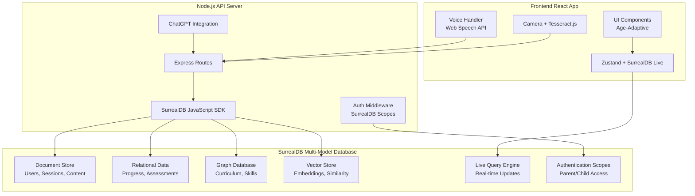

# Component Diagrams

## Frontend React App Integration



## SurrealDB Schema Evolution Strategy

```sql
-- Version tracking table
DEFINE TABLE schema_versions SCHEMAFULL;
DEFINE FIELD version ON schema_versions TYPE string;
DEFINE FIELD applied_at ON schema_versions TYPE datetime DEFAULT time::now();
DEFINE FIELD description ON schema_versions TYPE string;

-- Migration scripts as SurrealQL files
-- migrations/001_initial_schema.surql
-- migrations/002_add_vector_search.surql
-- migrations/003_curriculum_graph.surql
```

## Performance Optimization

```sql
-- Indexes for common queries
DEFINE INDEX child_sessions_idx ON learning_sessions FIELDS child_id, start_time;
DEFINE INDEX skill_mastery_idx ON skill_mastery FIELDS child_id, skill_id;
DEFINE INDEX progress_tracking_idx ON progress_profiles FIELDS child_id, subject, updated_at;

-- Vector indexes for similarity searches
DEFINE INDEX content_similarity_idx ON curriculum_topics FIELDS content_embedding MTREE DIMENSION 384;
DEFINE INDEX skill_similarity_idx ON skill_mastery FIELDS skill_embedding MTREE DIMENSION 384;

-- Authentication and session indexes
DEFINE INDEX family_email_idx ON auth_families FIELDS parent_email;
DEFINE INDEX session_user_idx ON auth_sessions FIELDS user_id, expires_at;
DEFINE INDEX child_family_idx ON auth_child_profiles FIELDS family_id, age_group;
```