# High Level Architecture

## Technical Summary

The system employs a SurrealDB-centric architecture where the multi-model database serves as the unified data layer for all application needs. SurrealDB's document storage handles user profiles and learning content, its relational capabilities manage structured progress data, graph features model curriculum relationships, and vector search enables intelligent content recommendations. The frontend uses React with TypeScript for age-adaptive interfaces, while the backend leverages Node.js with SurrealDB's native SDKs for real-time data operations.

## Platform and Infrastructure Choice

**Platform:** Self-hosted on free/low-cost providers with open source stack
**Primary Services:** 
- SurrealDB (single-node initially, distributed later)
- Node.js application server
- Static hosting for frontend (Netlify/Vercel free tier)
- ChatGPT API integration
- Tesseract.js for client-side OCR

**Deployment Host and Regions:** 
- Primary: Railway/Render free tier or DigitalOcean $6/month droplet
- Database: SurrealDB embedded or single-node deployment
- CDN: Cloudflare free tier for static assets

## Repository Structure

**Structure:** Monorepo with SurrealDB schema management
**Monorepo Tool:** Turborepo with npm workspaces
**Package Organization:** 
- apps/web - Frontend React application
- apps/api - Backend Node.js server with SurrealDB integration
- packages/database - SurrealDB schema, migrations, and utilities
- packages/shared - Shared types and SurrealDB query builders

## High Level Architecture Diagram

```mermaid
graph TB
    subgraph "Client Layer"
        WEB[Web Application<br/>React + TypeScript]
        CAM[Camera API<br/>WebRTC]
        MIC[Microphone API<br/>Web Speech]
        OCR[Tesseract.js<br/>Client-side OCR]
    end
    
    subgraph "CDN & Edge"
        CF[Cloudflare CDN<br/>Free Tier]
        STATIC[Static Assets<br/>Netlify/Vercel]
    end
    
    subgraph "Application Layer"
        API[API Server<br/>Node.js + Express]
        WS[WebSocket Server<br/>SurrealDB Live Queries]
        AUTH[Authentication<br/>SurrealDB + JWT]
    end
    
    subgraph "AI Services"
        GPT[ChatGPT API<br/>Conversational AI]
        TTS[Web Speech API<br/>Browser Native]
        STT[Web Speech API<br/>Browser Native]
    end
    
    subgraph "SurrealDB Multi-Model Layer"
        SURREAL[(SurrealDB<br/>Single Database)]
        DOC[Document Store<br/>User Profiles, Content]
        REL[Relational Data<br/>Progress, Sessions]
        GRAPH[Graph Database<br/>Curriculum Dependencies]
        VECTOR[Vector Search<br/>Content Similarity]
        LIVE[Live Queries<br/>Real-time Updates]
    end
    
    subgraph "External Services"
        EMAIL[Email Service<br/>Free SMTP or Resend]
        MONITORING[Simple Analytics<br/>Plausible/Umami]
    end
    
    WEB --> CF
    CF --> STATIC
    CAM --> OCR
    MIC --> WS
    
    API --> AUTH
    API --> GPT
    WS --> LIVE
    
    API --> DOC
    API --> REL
    API --> GRAPH
    API --> VECTOR
    
    WS --> SURREAL
    AUTH --> SURREAL
    
    API --> EMAIL
    API --> MONITORING
```

## Architectural Patterns

- **SurrealDB-First Design:** All data operations leverage SurrealDB's multi-model capabilities - _Rationale:_ Simplifies architecture while providing advanced features like real-time queries and graph traversal
- **Event-Driven Architecture:** SurrealDB live queries for real-time updates - _Rationale:_ Eliminates need for separate WebSocket state management
- **Client-Side Processing:** Browser-native speech API and Tesseract.js OCR - _Rationale:_ Reduces server costs and improves privacy
- **Graph-Powered Learning:** Curriculum and skill dependencies modeled as graph relationships - _Rationale:_ Enables intelligent learning path recommendations
- **Vector-Enhanced Intelligence:** Embeddings stored in SurrealDB for content similarity - _Rationale:_ Improves learning recommendations without external vector databases