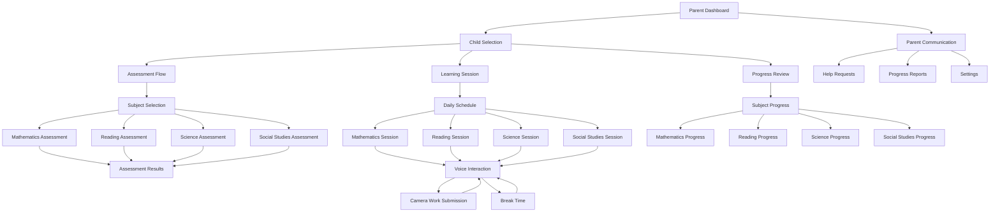
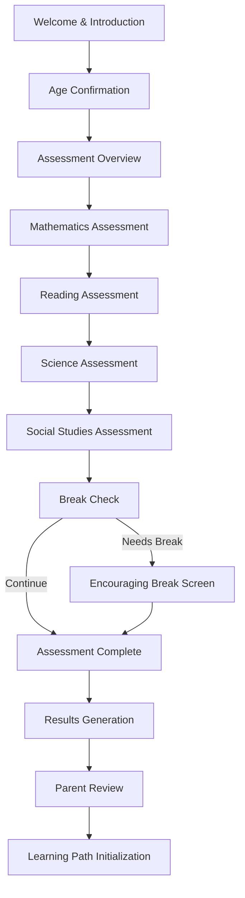
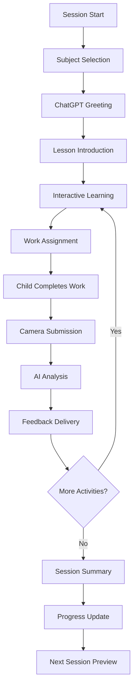
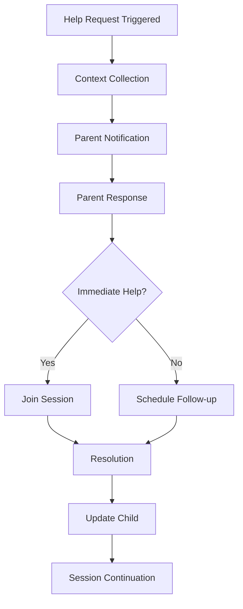

# AI-Powered Homeschooling Application UI/UX Specification

## Introduction

This document defines the user experience goals, information architecture, user flows, and visual design specifications for the AI-powered homeschooling application. It serves as the foundation for visual design and frontend development, ensuring a cohesive and user-centered experience across multiple age groups and subject areas.

### Overall UX Goals & Principles

#### Target User Personas

**5-Year-Old Learner (Early Elementary):**
- Cognitive abilities: Concrete thinking, short attention spans (10-15 minutes), learning through play and exploration
- Motor skills: Developing fine motor control, prefers large touch targets
- Technology comfort: Basic touch interactions, responds well to visual and audio cues
- Learning style: Highly interactive, immediate feedback, frequent encouragement
- Communication: Simple vocabulary, enjoys storytelling and imaginative scenarios

**10-Year-Old Learner (Elementary):**
- Cognitive abilities: Developing abstract thinking, moderate attention spans (20-30 minutes), enjoys problem-solving
- Motor skills: Confident with devices, can handle more complex interactions
- Technology comfort: Familiar with tablets and basic voice commands
- Learning style: Structured but flexible, enjoys challenges and achievement recognition
- Communication: Expanded vocabulary, can follow multi-step instructions

**13-Year-Old Learner (Middle School):**
- Cognitive abilities: Abstract thinking, longer attention spans (30-45 minutes), values independence
- Motor skills: Advanced device proficiency, expects sophisticated interactions
- Technology comfort: Tech-native, expects responsive and intelligent systems
- Learning style: Self-directed with guidance, values credible and relevant content
- Communication: Adult-level vocabulary, appreciates respect for their intelligence

**Homeschooling Parent (Secondary User):**
- Goals: Monitor progress, provide support when needed, ensure comprehensive education
- Pain points: Managing multiple children's education simultaneously
- Technology comfort: Varies, needs intuitive interfaces for oversight functions
- Time constraints: Wants efficient ways to understand children's progress and needs

#### Usability Goals

- **Intuitive Voice Interaction:** Children can begin conversations naturally without technical barriers within 30 seconds of system access
- **Age-Appropriate Complexity:** Interface complexity scales appropriately - 5-year-olds see simple, large elements while 13-year-olds access more sophisticated controls
- **Seamless Subject Transitions:** Moving between mathematics, reading, science, and social studies feels natural and maintains engagement
- **Effortless Work Submission:** Camera-based work submission requires minimal steps and provides clear feedback across all subjects
- **Immediate Response:** All voice interactions respond within 2 seconds to maintain conversation flow
- **Error Recovery:** When technical issues occur, children receive clear, age-appropriate guidance to resolve problems

#### Design Principles

1. **Voice-First, Visually Supported** - Prioritize conversational interaction while providing clear visual cues for system status and next actions
2. **Age-Adaptive Complexity** - Interface elements scale in sophistication based on user age without feeling condescending
3. **Subject-Agnostic Consistency** - Core interaction patterns remain consistent whether working on math, reading, science, or social studies
4. **Encouraging by Default** - All feedback, error messages, and system responses maintain a positive, supportive tone
5. **Parent-Child Balance** - Enable parent oversight without undermining child autonomy and engagement

### Change Log
| Date | Version | Description | Author |
|------|---------|-------------|---------|
| 2025-01-15 | 1.0 | Initial UI/UX specification creation | Sally (UX Expert) |

## Information Architecture (IA)

### Site Map / Screen Inventory

### Navigation Structure

**Primary Navigation (Parent Level):**
- Child account selection and management
- Overall progress dashboard across all subjects
- System settings and preferences
- Communication center for help requests

**Secondary Navigation (Child Level):**
- Subject-specific learning areas (Math, Reading, Science, Social Studies)
- Daily schedule and session management
- Personal progress viewing (age-appropriate)
- Help/parent call button (always accessible)

**Breadcrumb Strategy:**
- 5-year-olds: Simple visual progress indicators (colorful dots showing session progress)
- 10-year-olds: Basic breadcrumbs showing Subject > Topic > Activity
- 13-year-olds: Full navigation breadcrumbs with ability to jump between sections

## User Flows

### Initial Assessment Flow

**User Goal:** Complete comprehensive multi-subject assessment to establish learning baselines

**Entry Points:** New user account creation, annual re-assessment, parent-requested assessment

**Success Criteria:** Child completes assessment across all subjects, system generates detailed ability profiles, learning paths are initialized

#### Flow Diagram

#### Edge Cases & Error Handling:
- Child becomes frustrated or tired during assessment - offer breaks and encouragement
- Voice recognition fails repeatedly - provide alternative input methods
- Assessment interrupted - save progress and allow resumption
- Child performs unexpectedly (too high/low) - adjust assessment dynamically

**Notes:** Assessment feels conversational rather than test-like, with ChatGPT providing encouraging feedback throughout

### Daily Learning Session Flow

**User Goal:** Complete a structured learning session in one or more subjects with voice interaction and work submission

**Entry Points:** Daily schedule, subject-specific access, continuation of previous session

**Success Criteria:** Child engages in conversation, submits work via camera, receives feedback, completes session objectives

#### Flow Diagram

#### Edge Cases & Error Handling:
- Child requests help - immediate parent notification with context
- Camera fails or photo unclear - guide retaking with helpful tips
- Voice interaction breaks down - provide text backup or parent assistance
- Child loses focus - attention detection triggers re-engagement strategies
- Work assessment is unclear - request clarification rather than guess

**Notes:** Flow maintains conversational nature while providing structure and clear progress markers

### Parent Communication Flow

**User Goal:** Receive timely information about child's learning needs and progress

**Entry Points:** Child's help request, scheduled progress reports, system alerts

**Success Criteria:** Parent receives clear, actionable information about child's learning status

#### Flow Diagram

#### Edge Cases & Error Handling:
- Parent unavailable when help requested - escalation to secondary contacts
- Multiple children need help simultaneously - priority and queueing system
- Parent misunderstands child's need - provide detailed context and suggestions

**Notes:** Communication maintains child's autonomy while ensuring appropriate support

## Wireframes & Mockups

### Design Files
**Primary Design Files:** [To be created in Figma following this specification]

### Key Screen Layouts

#### Assessment Introduction (Age-Adaptive)

**Purpose:** Introduce the assessment process in age-appropriate ways

**Key Elements:**
- **5-year-old version:** Large, colorful cartoon character guide, simple language, big "Start" button
- **10-year-old version:** Friendly interface with clear progress indicators, encouraging messaging
- **13-year-old version:** Clean, respectful interface with detailed information and control options

**Interaction Notes:** All versions use voice introduction from ChatGPT with visual support

**Design File Reference:** [Figma frame: Assessment-Intro-Multi-Age]

#### Learning Session Interface (Voice-Primary)

**Purpose:** Main conversational learning environment with minimal visual distraction

**Key Elements:**
- Large, clear speaking/listening indicators
- Subject identification (subtle but clear)
- Progress indicator appropriate for age
- Help button (always accessible)
- Camera activation button when needed

**Interaction Notes:** Interface fades to background during conversation, brightens for visual tasks

**Design File Reference:** [Figma frame: Learning-Session-Voice-UI]

#### Camera Capture Interface (Cross-Subject)

**Purpose:** Simple, intuitive work submission across all academic subjects

**Key Elements:**
- Clear camera viewfinder with guide overlays
- Subject-specific tips (math: align equations, reading: capture full text, science: include diagrams)
- Simple capture button with audio feedback
- Retake option with encouraging messaging
- Preview and confirm submission

**Interaction Notes:** Voice guidance throughout process, visual confirmation of successful submission

**Design File Reference:** [Figma frame: Camera-Capture-Multi-Subject]

#### Progress Dashboard (Parent)

**Purpose:** Comprehensive view of child's learning across all subjects

**Key Elements:**
- Multi-subject progress overview
- Recent activity summary
- Areas needing attention alerts
- Communication history
- Quick access to detailed reports

**Interaction Notes:** Clean, data-rich interface with export options

**Design File Reference:** [Figma frame: Parent-Progress-Dashboard]

## Component Library / Design System

### Design System Approach
**Design System Approach:** Custom design system optimized for educational software with age-adaptive components

### Core Components

#### Voice Interaction Indicator

**Purpose:** Show system listening/speaking status clearly across all ages

**Variants:** 
- Active listening (animated pulse)
- Processing (thinking animation)
- Speaking (audio wave visualization)
- Inactive (subtle standby state)

**States:** 
- Default, Active, Processing, Error
- Age-specific styling (playful for 5yo, sophisticated for 13yo)

**Usage Guidelines:** Always visible during voice interactions, size scales with age group

#### Subject Identifier

**Purpose:** Clear indication of current academic subject without being distracting

**Variants:**
- Mathematics (blue theme, calculator icon)
- Reading (green theme, book icon)
- Science (purple theme, microscope icon)
- Social Studies (orange theme, globe icon)

**States:** Active, Inactive, Transitioning

**Usage Guidelines:** Subtle presence during learning, more prominent during subject transitions

#### Camera Capture Control

**Purpose:** Intuitive work submission interface across all subjects

**Variants:**
- Mathematics capture (alignment guides for equations)
- Reading capture (text recognition overlay)
- Science capture (diagram-friendly framing)
- Social Studies (flexible framing for maps, timelines)

**States:** Ready, Capturing, Processing, Success, Error, Retake

**Usage Guidelines:** Context-sensitive help text, voice guidance integration

#### Progress Indicator (Age-Adaptive)

**Purpose:** Show learning progress appropriate for cognitive development

**Variants:**
- 5-year-old: Colorful stars or animal progression
- 10-year-old: Progress bars with achievement badges
- 13-year-old: Detailed analytics with goal tracking

**States:** In Progress, Completed, Needs Attention, Mastered

**Usage Guidelines:** Encouraging rather than comparative, celebrates effort and improvement

## Branding & Style Guide

### Visual Identity
**Brand Guidelines:** Warm, approachable educational technology that feels supportive rather than institutional

### Color Palette

| Color Type | Hex Code | Usage |
|------------|----------|-------|
| Primary | #4A90E2 | Main interactive elements, trust-building |
| Secondary | #7ED321 | Success states, positive feedback |
| Accent | #F5A623 | Attention-drawing elements, warnings |
| Success | #50E3C2 | Correct answers, completed tasks |
| Warning | #F5A623 | Needs attention, non-critical alerts |
| Error | #D0021B | System errors, incorrect responses (used sparingly) |
| Neutral Dark | #4A4A4A | Primary text, serious content |
| Neutral Medium | #9B9B9B | Secondary text, inactive states |
| Neutral Light | #F8F8F8 | Backgrounds, subtle containers |

### Typography

#### Font Families
- **Primary:** Open Sans (readable, friendly, excellent multilingual support)
- **Secondary:** Quicksand (playful headings for younger users)
- **Monospace:** Source Code Pro (code examples in advanced lessons)

#### Type Scale

| Element | Size | Weight | Line Height |
|---------|------|--------|-------------|
| H1 | 28px (5yo), 32px (10yo), 36px (13yo) | 600 | 1.2 |
| H2 | 24px (5yo), 26px (10yo), 28px (13yo) | 600 | 1.3 |
| H3 | 20px (5yo), 22px (10yo), 24px (13yo) | 600 | 1.4 |
| Body | 16px (5yo), 16px (10yo), 16px (13yo) | 400 | 1.5 |
| Small | 14px (5yo), 14px (10yo), 14px (13yo) | 400 | 1.4 |

### Iconography

**Icon Library:** Feather Icons for system elements, custom educational icons for subjects

**Usage Guidelines:** 
- Consistent style across all age groups
- Subject-specific icons use recognizable metaphors
- Voice interaction icons are animated to show system state
- Size scales appropriately for age and motor skills

### Spacing & Layout

**Grid System:** 8px base grid with 16px, 24px, 32px, 48px common intervals

**Spacing Scale:** 
- 5-year-old interfaces: Generous spacing (24px+ between interactive elements)
- 10-year-old interfaces: Moderate spacing (16px+ between elements)
- 13-year-old interfaces: Efficient spacing (8px+ between elements)

## Accessibility Requirements

### Compliance Target
**Standard:** WCAG 2.1 AA compliance with enhanced considerations for children's needs

### Key Requirements

**Visual:**
- Color contrast ratios: Minimum 4.5:1 for normal text, 3:1 for large text
- Focus indicators: Prominent 3px blue outline for keyboard navigation
- Text sizing: Scalable up to 200% without horizontal scrolling

**Interaction:**
- Keyboard navigation: Full functionality available via keyboard for backup to voice
- Screen reader support: Comprehensive ARIA labels and semantic HTML structure
- Touch targets: Minimum 44px x 44px, larger for younger children (64px+ for 5-year-olds)

**Content:**
- Alternative text: Descriptive alt text for all educational images and diagrams
- Heading structure: Logical H1-H6 hierarchy for screen reader navigation
- Form labels: Clear, associated labels for all form inputs

**Voice Accessibility:**
- Speech rate options: Adjustable for processing differences
- Voice alternatives: Text backup for all voice interactions
- Clear pronunciation: System uses clear, age-appropriate pronunciation

### Testing Strategy
**Accessibility Testing:** 
- Automated testing with axe-core
- Manual testing with keyboard navigation
- Screen reader testing with NVDA and VoiceOver
- Testing with children who have accessibility needs
- Regular accessibility audits during development

## Responsiveness Strategy

### Breakpoints

| Breakpoint | Min Width | Max Width | Target Devices |
|------------|-----------|-----------|----------------|
| Mobile | 320px | 767px | Phones (secondary support) |
| Tablet | 768px | 1023px | Tablets (primary target) |
| Desktop | 1024px | 1439px | Laptops and desktops |
| Wide | 1440px | - | Large monitors and displays |

### Adaptation Patterns

**Layout Changes:** 
- Tablet (primary): Optimized voice interaction with large touch targets
- Desktop: Enhanced parent oversight features, dual-child support
- Mobile: Simplified interface for emergency access or brief check-ins

**Navigation Changes:**
- Tablet: Voice-first with minimal visual navigation
- Desktop: Traditional navigation available for parent functions
- Mobile: Simplified menu with essential functions only

**Content Priority:**
- All devices prioritize voice interaction and camera functionality
- Desktop adds enhanced progress viewing and multi-child management
- Mobile focuses on core learning tasks and parent communication

**Interaction Changes:**
- Tablet: Optimized for touch and voice interaction
- Desktop: Mouse and keyboard support for parent functions
- Mobile: Touch-optimized with simplified voice controls

## Animation & Micro-interactions

### Motion Principles
**Motion Principles:** 
- Encouraging and supportive: Animations celebrate progress and provide positive feedback
- Age-appropriate energy: Playful for younger children, sophisticated for teenagers
- Functional first: Motion serves clear purposes (feedback, guidance, state changes)
- Respectful timing: Never interrupts voice interaction or learning flow

### Key Animations

- **Voice State Transitions:** Smooth pulsing during listening, gentle wave during speaking (Duration: Continuous, Easing: ease-in-out)
- **Subject Transitions:** Gentle color shift and icon animation when changing subjects (Duration: 300ms, Easing: ease-out)
- **Success Feedback:** Celebratory animation for correct answers and completed tasks (Duration: 500ms, Easing: bounce)
- **Camera Capture:** Satisfying snap animation with confirmation (Duration: 200ms, Easing: ease-in)
- **Progress Updates:** Smooth bar filling or star earning animations (Duration: 800ms, Easing: ease-out)
- **Attention Re-engagement:** Gentle pulsing to regain focus without being disruptive (Duration: 1000ms, Easing: ease-in-out)

## Performance Considerations

### Performance Goals
- **Voice Response Time:** Under 2 seconds from speech to system response
- **Camera Processing:** Photo analysis and feedback within 30 seconds
- **Interface Responsiveness:** All interactions respond within 100ms
- **Session Loading:** Learning sessions start within 3 seconds

### Design Strategies
**Performance Strategies:**
- Minimize visual complexity during voice interactions to reduce processing load
- Optimize images and animations for tablet hardware capabilities
- Use progressive loading for subject content to reduce initial load times
- Cache frequently used educational content locally
- Design offline capabilities for core learning functions when internet is unavailable

## Next Steps

### Immediate Actions
1. **Create detailed mockups** for each age group in Figma with complete user flows
2. **Develop component library** with age-adaptive styling and voice interaction patterns
3. **Create accessibility testing protocols** specific to children's educational software
4. **Design voice interaction guidelines** for ChatGPT integration across all subjects
5. **Establish usability testing plan** with children in each age group across all subjects

### Design Handoff Checklist
- [x] All user flows documented for multi-subject learning
- [x] Component inventory complete with age-adaptive variants
- [x] Accessibility requirements defined for children's educational needs
- [x] Responsive strategy clear for primary tablet target
- [x] Brand guidelines incorporated with educational focus
- [x] Performance goals established for voice and camera interactions
- [ ] Detailed mockups created for development handoff
- [ ] Voice interaction design patterns documented
- [ ] Parent oversight interfaces designed
- [ ] Multi-subject content organization finalized

## Checklist Results
*[This section will be populated if a UI/UX checklist is available]*